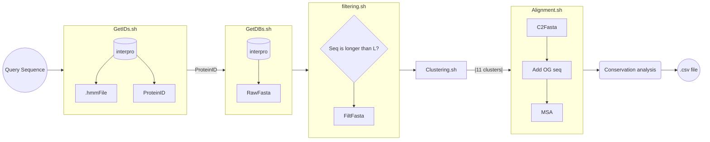

### Dpipeline

```mermaid
    flowchart LR
    input((Query Sequence))

    subgraph A[GetIDs.sh]
        direction TB
        id3[(interpro)] -->.hmmFile
        id3[(interpro)] -->ProteinID  
    end 
    
    subgraph B[GetDBs.sh]
        direction TB
        id4[(interpro)] -->
        RawFasta 
    end
    subgraph C[filtering.sh]
        direction TB
        C1{Seq is longer than L?} -->  
        FiltFasta
    end
    subgraph D[Alignment.sh]
        direction TB
        D1[C2Fasta] -->
        D2[Add OG seq] -->
        D3[MSA]
    end
    
    cons(Conservation analysis)
    output((.csv file))

    input --> A 

    A--ProteinID--> B 
    B --> C
    C--> Clustering.sh 
    Clustering.sh --|11 clusters|--> D
    D --> cons --> output
```

