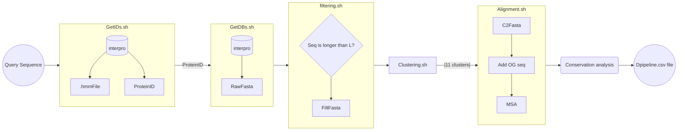
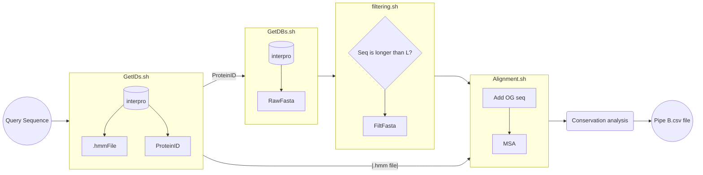
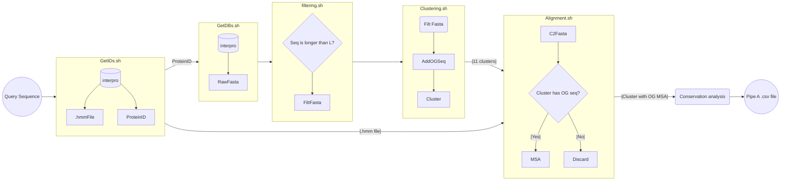

# Pipeline A

```mermaid
    flowchart LR
    input((Query Sequence))

    subgraph A[GetIDs.sh]
        direction TB
        id3[(interpro)] -->.hmmFile
        id3[(interpro)] -->ProteinID  
    end 
    
    subgraph B[GetDBs.sh]
        %% this is a comment
        direction TB
        id4[(interpro)] -->
        RawFasta 
    end
    subgraph C[filtering.sh]
        direction TB
        C1{Seq is longer than L?} -->  
        FiltFasta
    end
    subgraph D[Alignment.sh]
        direction TB
        D1[C2Fasta] -->
        D2[Add OG seq] -->
        D3[MSA]
    end
    
    cons(Conservation analysis)
    output((Dpipeline.csv file))

    input --> A 

    A--ProteinID--> B 
    B --> C
    C--> Clustering.sh 
    Clustering.sh --|11 clusters|--> D
    D --> cons --> output
```

# Pipeline B

```mermaid
    flowchart LR
    %% A = Getid
    %% B = GetDB
    %% C = Filter.sh
    %% D = Alignment + Add ogseq
    
    input((Query Sequence))
    %%A
    subgraph A[GetIDs.sh]
        direction TB
        id3[(interpro)] -->.hmmFile
        id3[(interpro)] -->ProteinID  
    end 
    %%B
    subgraph B[GetDBs.sh]
        direction TB
        id4[(interpro)] -->
        RawFasta 
    end
    %%C
    subgraph C[filtering.sh]
        direction TB
        C1{Seq is longer than L?} -->  
        FiltFasta
    end
    

    %%D
    subgraph D[Alignment.sh]
        direction TB
        D2[Add OG seq] -->
        D3[MSA]
    end
    
    cons(Conservation analysis)
    output((Pipe B.csv file))

    input --> A 
    A--ProteinID--> B 
    B --> C
    C ---> D
    A --|.hmm file|--> D
    D --> cons --> output
```

# Pipeline C

```mermaid
    flowchart LR
    %% A = Getid
    %% B = GetDB
    %% C = Filter.sh
    %% D = Clustering with add og seq
    %% E = Alignment + selection of cluster with OG
    
    input((Query Sequence))
    %%A
    subgraph A[GetIDs.sh]
        direction TB
        id3[(interpro)] -->.hmmFile
        id3[(interpro)] -->ProteinID  
    end 
    %%B
    subgraph B[GetDBs.sh]
        direction TB
        id4[(interpro)] -->
        RawFasta 
    end
    %%C
    subgraph C[filtering.sh]
        direction TB
        C1{Seq is longer than L?} -->  
        FiltFasta
    end
    %%D
    subgraph D[Clustering.sh ]
        direction TB
        D1(Filt Fasta) -->
        AddOGSeq --> 
        Cluster 
    end

    %%E
    subgraph E[Alignment.sh]
        direction TB
        E1[C2Fasta] -->
        E2{Cluster has OG seq?} --|Yes|-->
        E3[MSA]
        E2{Cluster has OG seq?} --|No|--> Discard
        
    end
    
    cons(Conservation analysis)
    output((Pipe A .csv file))

    input --> A 
    A--ProteinID--> B 
    B --> C
    C ---> D
    D --|11 clusters|--> E
    A --|.hmm file|--> E
    E --|Cluster with OG MSA|--> cons --> output
```