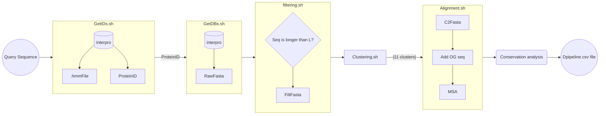
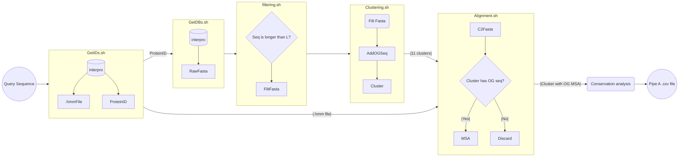
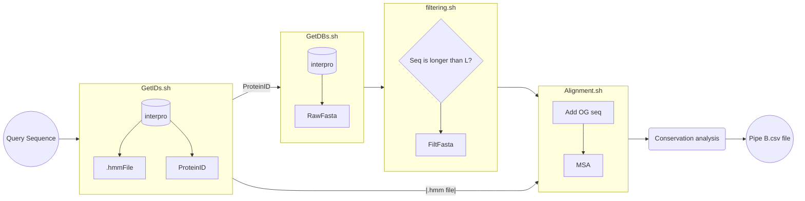

Workflow

This worflow file will contain a brief diagram with how  the modules for dpipeline will be connected in nextflow for easy implementation:

## Original diagram:

ObtainIDs.sh(Fasta seq) ---> .hmm file(a) + FamilyID(b)                      (1)
Getdb.sh((1b)) ---> .Fasta file with all sequences associated with Family ID (2)
filter.sh((2)) ---> Filetered sequences with an # length of filtering        (3)
clustering.sh((3)) ---> 0-11 clusters with $prefix_clu_seq.(1-11)            (4) 
Split.sh(4) ---> creates a 80/20 split for training/test by randomly removing clusters (5)   For future iterations not currently been worked on
Alignment.sh((5)+(1a))---> 0-11 MSA files based on each cluster or tr/tst              (6)
Drop.sh((6)) --->  Drop columns assigned as gaps from the MSAs                         (7) 



 ## Pipeline_A: Cluster MSA where OG seq is

```markdown
→ ObtainIDs.sh (Fasta seq) ---> .hmm file(a) + FamilyID(b)                      (1)
→ Getdb.sh ((1b)) ---> .Fasta file with all sequences associated with Family ID (2)
→ filter.sh ((2)) ---> Filetered sequences with an # length of filtering        (3)
→ AddOgSeq ((3)) ---> Filtered fasta + og seq in first position                 (4)
→ clustering.sh ((4)) ---> 0-11 clusters with $prefix_clu_seq.(1-11)            (5)
→ Alignment.sh ((5)+(1a)) --> MSA from selected cluster*                        (6)
→ Cons_analysis ((6)) ---> List of conserved residues from OG sequence          (7)

```




## Pipeline_B: Full MSA for VAE training + Cons_analysis
```markdown
→ ObtainIDs.sh (Fasta seq) ---> .hmm file(a) + FamilyID(b)                      (1)
→ Getdb.sh ((1b)) ---> .Fasta file with all sequences associated with Family ID (2)
→ filter.sh ((2)) ---> Filetered sequences with an # length of filtering        (3)
→ AddOgSeq ((3)) ---> Filtered fasta + og seq in first position                 (4)
→ Alignment.sh ((4)+(1a)) ---> Big MSA file                                     (5)
→ Cons_analysis ((5)) ---> List of conserved residues from OG sequence          (6)
```


