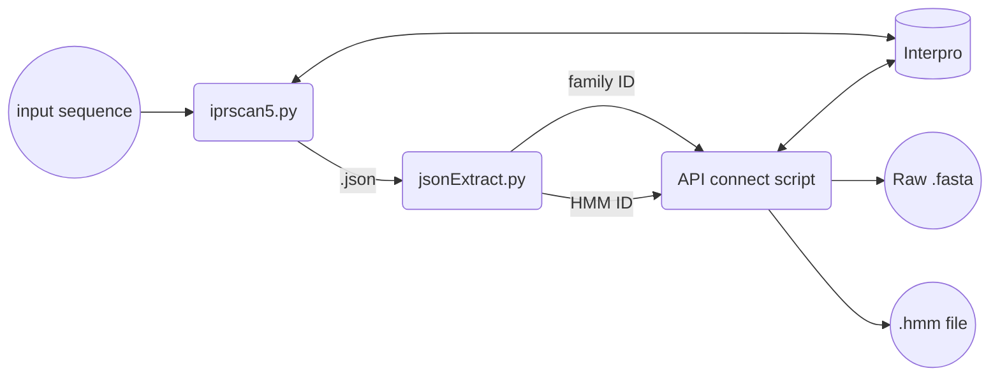

```mermaid
    flowchart LR
    A((input sequence)) 
    B(iprscan5.py)
    C[(Interpro)]
    D(jsonExtract.py)
    E(API connect script)
    F((Raw .fasta))
    G((.hmm file))

    A --> B
    B <--> C
    B --.json--> D
    D --family ID--> E
    D --HMM ID--> E
    E <--> C
    E --> F
    E --> G


```